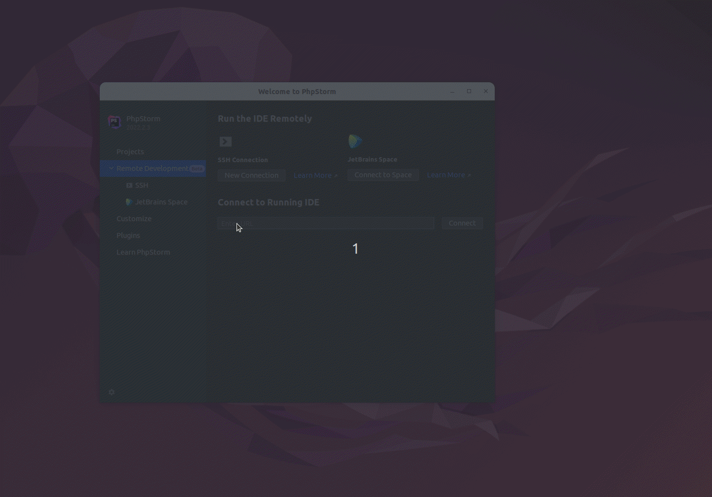

# ISLE: Docker Prototype <!-- omit in toc -->

[](./LICENSE)
[](https://github.com/Islandora-Devops/isle-buildkit/actions/workflows/push.yml)

- [Introduction](#introduction)
- [Requirements](#requirements)
  - [Windows](#windows)
- [Tooling](#tooling)
  - [Make](#make)
  - [Gradle](#gradle)
  - [Github Actions](#github-actions)
- [Building](#building)
  - [Build All Images](#build-all-images)
  - [Build Specific Image](#build-specific-image)
- [Testing](#testing)
  - [Test Specific Image](#test-specific-image)
- [Running](#running)
  - [IDE](#ide)
  - [PHPStorm](#phpstorm)
- [Docker Images](#docker-images)
  - [Updating Dependencies](#updating-dependencies)
    - [Updating Composer](#updating-composer)
    - [Renovate](#renovate)
  - [Updating Configuration](#updating-configuration)
- [Design Considerations](#design-considerations)
  - [Confd](#confd)
  - [S6 Overlay](#s6-overlay)
  - [Image Hierarchy](#image-hierarchy)
  - [Folder Layout](#folder-layout)
  - [Build System](#build-system)
  - [Multi-arch builds](#multi-arch-builds)
  - [Caching](#caching)
- [Design Constraints](#design-constraints)
- [Issues / FAQ](#issues--faq)

## Introduction

This repository provides a number of docker images which can be used to build an
Islandora site. On commit, these images are automatically pushed to
[Docker Hub] via Github Actions. Which are consumed by [isle-dc] and
[isle-site-template]. They can also be used by other Docker orchestration tools
such as Swarm / Kubernetes. Reach out on the community slack for other example
installations.

It is **not** meant as a starting point for new users or those unfamiliar with
Docker, or basic server administration.

If you are looking to use islandora please read the [official documentation] and
use either [isle-dc] or the [isle-site-template] to deploy via [Docker] or the
[islandora-playbook] to deploy via [Ansible].

## Requirements

To build the Docker images using the provided Gradle build scripts requires:

- [Docker 20.10+](https://docs.docker.com/get-docker/)
- [GNU Make 4.3+](https://www.gnu.org/software/make/)
- [jq 1.6+](https://stedolan.github.io/jq/)
- [mkcert 1.4+](https://github.com/FiloSottile/mkcert)
- [OpenJDK or Oracle JDK 11+](https://www.java.com/en/download/)
- [pre-commit 2.19+](https://pre-commit.com/)

> N.B You can use older versions of Docker to run the images, just not build
> them.

> N.B If you use Firefox you will also have to install `nss` to use `mkcert` see
> the [docs](https://github.com/FiloSottile/mkcert#installation).

> N.B The version of `make` that comes with OSX is to old, please update
> using `brew` etc.

> N.B On Mac OSX you may need to run `docker context use default` before `make bake`

To verify you have all the requirements run the following command.

```bash
make setup
```

If it is unsuccessful you should see the following message:

```bash
Could not find executable: XXXX
Consult the README.md for how to install requirements.
```

### Windows

Since this repository relies on `make` you must use WSL2 to invoke it, and all
dependencies should be installed inside of the WSL2 context. With the exeception
of `mkcert` which must be installed in the host Windows context, as it needs to
modify the Windows trust store so that the browsers will support the generated
certificates.

> N.B Firefox is not a supported browser on Windows for this project, you must
> use Edge or Chrome.

## Tooling

There are a number of tools you can use to [build](#building) and
[test](#testing) the images produced by this repository. In general there are
tools like `docker buildx` and `docker compose` that can be invoked directly or
you can the wrapper tools like [make](#make), [gradle](#gradle). Using the
wrapper tools has some advantages and is generally recommended, but it is
occasionally good to revert to the tools they wrap around if you need to debug
an issue with the building or testing.

### Make

[Building](#building) and [running](#running) relies on Make. You can see the
tasks available by invoking Make with no arguments. Make is really only
supported in Linux/OSX, or if you are using Windows you can use
[Windows Subsystem for Linux (WSL)](https://learn.microsoft.com/en-us/windows/wsl/install)

```bash
make
```

Which yields:

```bash
Usage:
  make <target>

BuildKit:
  bake                           Builds and loads the target(s) into the local docker context.
  push                           Builds and pushes the target(s) into remote repository.
  manifest                       Creates manifest for multi-arch images.

Compose:
  up                             Starts up the local development environment.
  down                           Stops the local development environment.

General:
  test                           Run all tests
  clean                          Destroys local environment and cleans up any uncommitted files.
  purge                          Destroys all data.
  help                           Displays this help message.
```

### Gradle

[Testing](#testing) and [generating security reports](#grype) as well as
[DockerHub maintenance](#dockerhub) rely on Gradle and should function equally
well across platforms. The only difference being the script you call to interact
with gradle (the following assumes you are executing from the **root directory**
of the project):

**Linux or OSX:**

```bash
./gradlew
```

**Windows:**

```bash
gradlew.bat
```

For the remaining examples the **Linux or OSX** call method will be used, if
using Windows substitute the call to Gradle script.

Gradle is a project/task based build system to query all the available tasks use
the following command.

```bash
./gradlew tasks --all
```

Which should return something akin to:

```bash
> Task :tasks

------------------------------------------------------------
Tasks runnable from root project
------------------------------------------------------------

...
Isle DockerHub tasks
--------------------
deleteEligibleDockerHubTags - Delete eligible tags from DockerHub 'islandora/cache' Repository.
getDockerHubTagsEligibleForDeletion - Gets the tags eligible for removal from DockerHub 'islandora/cache' Repository.
getDockerHubToken - Gets the login token required for interacting with DockerHub Rest API.
getProtectedDockerHubTags - Gets the tags which should not be removed by DockerHub cleanup inactive tags task.

Isle Reports tasks
------------------
grype - Process the software bill of material with Grype
pullGrype - Pull anchore/grype docker image
pullSyft - Pull anchore/syft docker image
syft - Generate a software bill of material with Syft
updateGrypeDB - Update the Grype Database

Isle Tests tasks
----------------
cleanUpAfter - Clean up resources after running test
cleanUpBefore - Clean up resources before running test (if interrupted externally, etc)
setUp - Prepare to run test
test - Perform test

...
```

In Gradle each Project maps onto a folder in the file system path where it is
delimited by `:` instead of `/` (Unix) or `\` (Windows).

The root project `:` can be omitted.

So if you want to run a particular task `taskname` that resided in the project
folder `project/subproject` you would specify it like so:

```bash
./gradlew :project:subproject:taskname
```

To get more verbose output from Gradle use the `--info` argument like so:

```bash
./gradlew :PROJECT:TASK --info
```

### Github Actions

This repository makes use of [Github Actions] to perform a number of tasks.

| Workflow                                                                 | Description                                                            |
| :----------------------------------------------------------------------- | :--------------------------------------------------------------------- |
| [cleanup.yml](.github/workflows/cleanup.yml)                             | Deletes old tags in DockerHub once a week.                             |
| [dockerhub-description.yml](.github/workflows/dockerhub-description.yml) | Updates DockerHub Description of images to match README.md files.      |
| [push.yml](.github/workflows/push.yml)                                   | Builds and Tests images and generates a security vulnerability report. |

## Building

This repository makes use of [buildx] which is a wrapper around [buildkit] to
build all the images. This can be invoked directly like so:

```bash
docker buildx bake <target>
```

By default if no `<target>` is specified it will build all the images in this
repository.

Alternatively you can use `make` to invoke `bake`, it is advantageous as it will
pass in additional properties that should allow you to make use of the remote
cache.

```bash
make bake
```

If you want to build cross platform issues, please use the [isle-builder]
repository for setting up a builder.

### Build All Images

The following will build all the images in the correct order.

```bash
make bake
```

By default this will produce images like `islandora/base:local` you can change
the repository and tag by specifying them as arguments, like so:

```bash
make bake REPOSITORY=foo TAGS=bar
```

This would produce images like `foo/base:bar`.

### Build Specific Image

To build a specific image and it's dependencies, for example
`islandora/tomcat`, you can use the following:

```bash
make bake TARGET=tomcat
```

If you do not want to build all it's dependent images you can set the context
using existing images like so:

```bash
make bake TARGET=nginx CONTEXTS="docker-image://islandora/base:1.0.10"
```

> N.B. Github actions do this to prevent rebuilding dependant images.

## Testing

There are a number of automated tests that are included in this repository which
can be found in the `tests` folders of each docker image project.

To run these tests use the following command:

```bash
./gradlew test
```

> N.B. Running all tests concurrently can saturate Docker's default number of
> bridge networks. Please see the [Issues/FAQ](#issues--faq) for how to remedy
> this.

### Test Specific Image

Alternatively you can test a single image like so:

```bash
./gradlew tomcat:test
```

## Running

While `isle-buildkit` does provide a test environment, it is not meant for
development on Islandora or as production environment. It is meant for testing
for breaking changes to the images provided by this repository. Instead please
refer to [isle-dc], or the [isle-site-template], for how to build your own
Islandora site.

To manually test changes in a functioning environment you can use the provided
`docker-compose.yml` file.

Though you must **first** generate certificates for use by `traefik`.

```bash
make certs
```

> N.B. This will prompt you for a password as generating a root Certificate
> requires administrative privileges.

You can interact with the `docker compose` directly instead of using
`make`.

```bash
docker compose up -d
```

Although you can interact with `docker compose` directly, it is recommend you
use `make` as this will ensure you have build all the images and generated the
required certificates needed, etc:

```bash
make up
```

This will bring up the environment based on [islandora-starter-site]. When
completed a message will print like so:

```
Waiting for installation...

  Credentials:
  Username                       admin
  Password                       password

  Services Available:
  Drupal                         https://islandora.dev
  IDE                            https://ide.islandora.dev
  ActiveMQ                       https://activemq.islandora.dev
  Blazegraph                     https://blazegraph.islandora.dev/bigdata/
  Fedora                         https://fcrepo.islandora.dev/fcrepo/rest/
  Matomo                         https://islandora.dev/matomo/index.php
  Solr                           https://solr.islandora.dev
  Traefik                        https://traefik.islandora.dev
```

To **stop** the containers use the following command:

```bash
make stop
```

To **destroy** this environment use the following command:

```bash
make down
```

The two commands can be used at once to ensure you are starting from a clean
environment:

```bash
make down up
```

### IDE

An `IDE` is provided at <http://ide.islandora.dev> which includes:

- Intellisense & Code Completion
- Build tasks for performing lints & other common actions (accessible via `CTRL-B` or `CMD-B`)
- Integrated Debugger (`XDebug`)
- `PHPCS` / `PHPCBF`
- etc...

To enable `XDebug` when using `drush` via the built-in terminal enter the
following command before invoking `drush`:

```bash
export XDEBUG_SESSION=1
```

For web requests, you must also send an `XDEBUG_SESSION` cookie with your
request, this can be toggled on and off via a browser plugin such as the
following.

- [Chrome](https://chrome.google.com/webstore/detail/xdebug-helper/eadndfjplgieldjbigjakmdgkmoaaaoc?hl=en)
- [Firefox](https://addons.mozilla.org/en-GB/firefox/addon/xdebug-helper-for-firefox/)


### PHPStorm

PHPStorm and alternative IDE's which allow for remote development via SSH are
also supported.

Add the following to your `~/.ssh/config` file:

```txt
Host islandora.dev
  ForwardAgent yes
  PasswordAuthentication yes
  Port 2222
  PreferredAuthentications password
  PubkeyAuthentication no
  StrictHostKeyChecking no
  User nginx
  UserKnownHostsFile /dev/null
```

You should now be able to ssh like so (assuming you've already brought the
docker compose environment up):

```bash
ssh islandora.dev
```

You can then connect via the PHP remote development feature.



> N.B. PHPStorm remote is not supported form Arm architectures so the above will
> not work on M1 macbooks and later.


## Docker Images

The following docker images are provided:

- [activemq]
- [alpaca]
- [base]
- [blazegraph]
- [cantaloupe]
- [crayfish]
- [crayfits]
- [drupal]
- [fcrepo6]
- [fits]
- [handle]
- [homarus]
- [houdini]
- [hypercube]
- [java]
- [mariadb]
- [matomo]
- [milliner]
- [nginx]
- [postgresql]
- [ripgrep]
- [solr]
- [test]
- [tomcat]

Many are intermediate images used to build other images in the list, for example
[java](./java/README.md). Please see the `README.md` of each image to find out
what settings, and ports, are exposed and what functionality it provides, as
well as how to update it to the latest releases.

Additionally this repository consumes [imagemagick] & [leptonica] images
produced by a separate repositories. Since it is a standalone image that rarely
changes and takes a while to build, due to building it under emulation.

### Updating Dependencies

To update the dependencies of a image follow this general pattern, for example [alpaca].

Update the following `ARG` values in

```dockerfile
ARG ALPACA_VERSION="x.x.x"
ARG ALPACA_FILE_SHA256="xxxxxxxxxxxxxxxxxxxxxxxxxxxxxxxxxxxxxxxxxxxxxxxxxxxxxxxxxxxxxxxx"
```

You'll have to download the new version you wish to update to, you can construct
the url from the the following `ARG` values in the [Dockerfile](./alpaca/Dockerfile),
to generate the `sha256` value to put in the above `ARG`.

```dockerfile
ARG ALPACA_VERSION="x.x.x"
ARG ALPACA_FILE="islandora-alpaca-app-${ALPACA_VERSION}-all.jar"
ARG ALPACA_URL="https://repo1.maven.org/maven2/ca/islandora/alpaca/islandora-alpaca-app/${ALPACA_VERSION}/${ALPACA_FILE}"
```

For example for the version `x.x.x`:

```bash
ALPACA_VERSION="x.x.x"
ALPACA_FILE="islandora-alpaca-app-${ALPACA_VERSION}-all.jar"
ALPACA_URL="https://repo1.maven.org/maven2/ca/islandora/alpaca/islandora-alpaca-app/${ALPACA_VERSION}/${ALPACA_FILE}"
wget "${ALPACA_URL}" &>/dev/null
shasum -a 256 ${ALPACA_FILE}
```

> N.B. Please read the release notes the new version and account for any changes
> to configuration that are required, as well as test locally.

#### Renovate

Several dependencies in this repo can be automatically updating using [renovate](https://www.mend.io/renovate/).

Currently these docker images have some depenencies managed by renovate:

```
activemq
blazegraph
cantaloupe
code-server
fcrepo6
fits
nginx
solr
tomcat
```

Since renovate does not natively support the ability to extract a sha256 from a file, we need [a custom shell script](./ci/update-sha.sh) in the [postUpgradeTasks](https://docs.renovatebot.com/configuration-options/#postupgradetasks) to calculate the sha256 of our files and update our Dockerfile accordingly.

Post upgrade tasks can only ran on self-hosted Renovate instances, so this forces us to run renovate either locally on a properly configured runner (instead of using their free GitHub app to manage our dependencies). Getting that setup looks like

```
npm install -g renovate
export RENOVATE_REPOSITORIES=islandora-devops/isle-buildkit
export RENOVATE_TOKEN=your-gh-pat
export RENOVATE_ALLOWED_POST_UPGRADE_COMMANDS='["^bash ci.*"]'

# this will issue a PR with any updates to our docker images
# that have renovate configured properly
renovate --platform=github
```

Many downloads from GitHub can used [advanced capture](https://docs.renovatebot.com/modules/manager/regex/#advanced-capture) in the Dockerfile to update the pinned version.


#### Updating Composer

A number of images like [crayfish] provide a `composer.lock` file to pin them to
particular dependencies.

When updating the dependencies be sure to search for `composer.lock` in the
`rootfs` folder of the image and update them as well.

This can be done by running the image after
[updating dependencies](#updating-dependencies), to get the latest code, and
running composer update. For example [crayfish]:

```bash
# Update ARGS as done in previous section
# ...
# Build image
make bake TARGET=crayfish
for lock in $(find crayfish -name "composer.lock"); \
do \
  docker run --rm -ti -v "$(pwd)/${lock}:${lock#crayfish/rootfs*}" -w $(dirname "${lock#crayfish/rootfs*}") --entrypoint composer islandora/crayfish:local update; \
done
```

### Updating Configuration

In particular review the files in
[rootfs/etc/confd](./alpaca/rootfs/etc/confd/), as configuration is likely to
change between releases.


## Design Considerations

All of the images build by this project are derived from the
[Alpine Docker Image] which is a Linux distribution built around [musl libc] and
[BusyBox].

> N.B. While [musl libc] is of general higher quality vs. [glibc], it is less
> commonly used and many libraries have come to depend on the undefined behavior
> of [glibc] so in some of our images we patch in [glibc] to ensure their
> correct function.

The image is only `5MB` in size and has access to a package repository. It has
been chosen for its small size, and ease of generating custom packages (as is
done in the [imagemagick] & [leptonica] images).

The [base] image includes two tools essential to the functioning of all the
images.

- [Confd]: Configuration Management
- [S6 Overlay]: Process Manager / Initialization system

### Confd

`confd` is used for all Configuration Management, it is how images are
customized on startup and during runtime. For each Docker image there will be a
folder `rootfs/etc/confd` that has the following layout:

```bash
./rootfs/etc/confd
├── conf.d
│   └── file.ext.toml
└── templates
    └── file.ext.tmpl
```

The `file.ext.toml` and `file.ext.tmpl` work as a pair. The `toml` file
defines where the template will be render to and who owns it. The `tmpl` file
being the template in question. Ideally these files should match the same name
of the file they are generating minus the `toml` or `tmpl` suffix. This is
to make their discovery easier.

Additionally in the `base` image there is `confd.toml` which sets defaults
such a the `log-level`:

```toml
backend = "env"
confdir = "/etc/confd"
log-level = "error"
interval = 600
noop = false
```

`confd` is also the source of all truth when it comes to configuration. We
have established a order of precedence in which environment variables at runtime
are defined.

1. Confd backend (highest)
2. Secrets kept in `/run/secrets` (Except when using `Kubernetes`)
3. Environment variables passed into the container
4. Environment variables defined in Dockerfile(s)
5. Environment variables defined in the `/etc/defaults` directory (lowest only used for multiline variables, such as JWT)

If not defined in the highest level the next level applies and so forth down the
list.

> N.B. `/etc/defaults` and the environment variables declared in the
> Dockerfile(s) used to create the image are **required** to define all
> environment variables used by scripts and `confd` templates. If not
> specified in either of those locations the environment variables will not be
> available even if its defined at a **higher** level i.e. `confd`.

The logic which enforces these rules is performed in
[container-environment.sh](base/rootfs/etc/s6-overlay/scripts/container-environment.sh)

> N.B Some containers derive environment variables dynamically from other
> environment variables. In these cases they are expected to provided an
> additional `oneshot` services that must be executed before the `confd-oneshot`
> so that the variables are defined before `confd` is used to render
> templates.

By either using the command `with-contenv` or starting a script with
`#!/command/with-contenv bash` the environment defined will follow the order
of precedence above. Additionally Within `confd` templates it is **required**
to use `getenv` function for fetching data, as the *final* value is written to
the container environment.

### S6 Overlay

[S6 Overlay] is the process supervisor we use in all the containers. It ensures
initialization happens in the correct order and services start in the correct
order (e.g. `fpm-php` starts prior to `nginx`, etc).

There are two types of services:

- `oneshot` Services: Short lived services, used to prepare the container prior to running services
- `longrun` Services: Long lived services like Nginx

Both types of services can have dependencies on one another, which indicates the
order in which they are executed. `oneshot` services are run to **completion**
before their dependent services are executed. `longrun` services are meant to
run indefinitely, if for some reason one fails the container will stop and exit
with the code of the failed service (provided a `finish` script is provided).

The `longrun` services have the following structure:

```bash
./rootfs/etc/s6-overlay/s6-rc.d
└── SERVICE_NAME
    ├── dependencies.d
    │   └── base
    ├── finish
    ├── run
    └── type
```

The `run` script is responsible for starting the service in the
**foreground**. The `finish` script can perform any cleanup necessary before
stopping the service, but in general it is used to kill the container, like so:

```bash
/run/s6/basedir/bin/halt
```

To declare dependencies between services, just add an empty file with the
services name in it's `dependencies.d` folder.

For scripts we want to run at startup run we must register them. This can be
done by placing an empty file named for the service in
`./rootfs/etc/s6-overlay/s6-rc.d/user/contents.d`.

There are only a few `longrun` services:

- activemq
- confd (optional, not enabled by default)
- fpm
- mysqld
- nginx
- solr
- tomcat
- etc

Of these only `confd` can be configured to run in every container, it
periodically listens for changes in it's configured backend (e.g. `etcd` or
`environment variables`) and will re-render the templates upon any change. See
it's [README.md](./base/README.md), for more information.

`oneshot` services are pretty much the same, except they use they `up` and
`down` instead of `run` and `finish`.

Additionally `up` is an [execline] script and does not support `bash`. So we
typically just call out to a `bash` script instead, which by convention can be
found in `./rootfs/etc/s6-overlay/scripts`.

One `oneshot` service is of particular interest to **all** the containers. The
`ready` service, which does not do anything in and of itself. It is meant as a
placeholder that other services can rely on to ensure that typical actions have
been performed, such as the configuration of environment variables, the
rendering of templates and so on.

> N.B. **All** `longrun` services should have a dependency on the `ready`
> service.

If you need to wait until a service to be ready for use, use the following
command:

```bash
# Wait for PHP-FPM to report it has started.
s6-svwait -U /run/service/fpm
```

> N.B. This requires the service to make use of
> [notification-fd](https://skarnet.org/software/s6/notifywhenup.html), which at
> the time of writing is only implemented for `nginx` and `php-fpm`

### Image Hierarchy

In order to save space and reduce the amount of duplication across images, they
are arranged in a hierarchy, that roughly follows below:

```bash
└── base
    ├── java
    │   ├── activemq
    │   ├── alpaca
    │   ├── solr
    │   └── tomcat
    │       ├── blazegraph
    │       ├── cantaloupe
    │       ├── fcrepo6
    │       └── fits
    ├── mariadb
    ├── postgresql
    └── nginx
        ├── crayfish
        │   ├── homarus
        │   ├── houdini (consumes [imagemagick] as well during its build stage)
        │   ├── hypercube (consumes [leptonica] as well during its build stage)
        │   ├── milliner
        │   └── riprap
        ├── crayfits
        ├── drupal
        │   └── test
        └── matomo
```

[imagemagick] & [leptonica] stand outside of the hierarchy as they are use only
to build packages that are consumed by other images during their build stage.

### Folder Layout

To make reasoning about what files go where each image follows the same
filesystem layout for copying files into the image.

A folder called `rootfs` maps directly onto the linux filesystem of the final
image. So for example `rootfs/etc/islandora/configs` will be
`/etc/islandora/configs` in the generated image.

### Build System

Since [bake] is used to build all the images, you must add new images to
[docker-bake.hcl](./docker-bake.hcl).

Be sure to update `IMAGES` and `DEPENDENCIES` variables for any new images
added, along with all the required targets for your new `IMAGE-NAME`:

- `IMAGE-NAME-common`: Properties shared by all the following targets.
- `IMAGE-NAME`: Targets the host platform.
- `IMAGE-NAME-amd64`: Targets amd64, regardless of host platform.
- `IMAGE-NAME-arm64`: Targets arm64, regardless of host platform.
- `IMAGE-NAME-ci`: Used to update the remote cache and build both `PLATFORM-ci` images.
- `IMAGE-NAME-amd64-ci`: Targets amd64, regardless of host platform updates remote cache.
- `IMAGE-NAME-arm64-ci`: Targets arm64, regardless of host platform updates remote cache.

### Multi-arch builds

For a number of the following reasons we've split the builds to build a single
image per architecture at a time rather than concurrently building multi-arch
images with `buildkit` even though that is a supported feature.

- Some Docker repositories such as GitLab's and Amazons do not handle OCI
  multi-arch images well, and it's good to be able to fall back onto a
  architecture specific image.
- The `buildkit` caching system is bugging when dealing with concurrent builds
  of multi-arch systems. It is better to split the caches by architecture to
  ensure cache stability.
- Being able to refer to an image by it's architecture directly is useful when
  testing for cross platform bugs.

That being said we still produce the OCI manifests for multi-arch images. For
local development this is not a requirement but the
[Github Actions](#github-actions) will do this when building.

```bash
make manifest TARGET=tomcat
```

So for example on any newish Docker the following command.

```bash
docker run --rm -ti --entrypoint uname islandora/base:latest -a
```

Will pull the appropriate image for the host platform without the user
explicitly specifying which of the images to e.g.

```bash
docker run --rm -ti --entrypoint uname islandora/base:latest-amd64 -a
```

Where the above command will explicitly pull the `amd64` image regardless of the
hosts architecture.

> N.B. By default local builds will not build multi-arch images, they will only
> build the platform supported by the host. The above really only is used by the
> Github Actions build jobs.

### Caching

The caching provided by `buildkit` is somewhat finicky and hard to control.
We've opted to use [registry-cache] by default. No other forms of caching are
supported.

Additionally things like the `s3` is too slow to be practical, and `gha` (Github
Actions cache) is not large enough to support all the images we build.

## Design Constraints

To be able to support a wide variety of backends for `confd`, as well as
orchestration tools, all calls **must use** `getenv` for the default value. With
the exception of keys that do not get used unless defined like
`DRUPAL_SITE_{SITE}_NAME`. This means the whatever backend for configuration,
wether it be `etcd`, `consul`, or `environment variables`, containers can
successfully start without any other container present. Additionally it ensure
that the order of precedence for configuration settings.

This does not completely remove dependencies between containers, for example,
when the [fcrepo6] starts it requires a running database like [mariadb] to be
able to start. In these cases an `oneshot` service can block until another
container is available or a timeout has been reached. For example:

```bash
# Need access to database to start wait up to 5 minutes (i.e 300 seconds).
if timeout 300 wait-for-open-port.sh "${DB_HOST}" "${DB_PORT}" ; then
    echo "Database Found"
else
    echo "Could not connect to Database"
    exit 1
fi
```

This allows container to start up in any order, and to be orchestrated by any tool.

## Issues / FAQ

**Question:** I'm getting the following error when building:

```bash
failed to solve with frontend dockerfile.v0: failed to solve with frontend
gateway.v0: runc did not terminate successfully: context canceled
```

**Answer:** If possible upgrade Docker to the latest version, and switch to
using the [Overlay2] filesystem with Docker.


**Question:** I'm getting the following error when running many tests at once:

```bash
ERROR: could not find an available, non-overlapping IPv4 address pool among the
defaults to assign to the network
```
**Answer:** By default Docker only allows **31** concurrent bridge networks to
be created, but you can change this in your `/etc/docker/daemon.json` file by
adding the following, and restarting `Docker`:

```json
{
  "default-address-pools" : [
    {
      "base" : "172.17.0.0/12",
      "size" : 20
    },
    {
      "base" : "192.168.0.0/16",
      "size" : 24
    }
  ]
}
```

[abuild]: ./abuild/README.md
[activemq]: ./activemq/README.md
[alpaca]: ./alpaca/README.md
[base]: ./base/README.md
[blazegraph]: ./blazegraph/README.md
[cantaloupe]: ./cantaloupe/README.md
[crayfish]: ./crayfish/README.md
[crayfits]: ./crayfits/README.md
[drupal]: ./drupal/README.md
[fcrepo6]: ./fcrepo6/README.md
[fits]: ./fits/README.md
[handle]: ./handle/README.md
[homarus]: ./homarus/README.md
[houdini]: ./houdini/README.md
[hypercube]: ./hypercube/README.md
[java]: ./java/README.md
[mariadb]: ./mariadb/README.md
[matomo]: ./matomo/README.md
[milliner]: ./milliner/README.md
[nginx]: ./nginx/README.md
[postgresql]: ./postgresql/README.md
[ripgrep]: ./ripgrep/README.md
[solr]: ./solr/README.md
[test]: ./test/README.md
[tomcat]: ./tomcat/README.md

[Alpine Docker Image]: https://hub.docker.com/_/alpine
[Ansible]: https://docs.ansible.com/ansible/latest/user_guide/index.html#getting-started
[bake]: https://docs.docker.com/engine/reference/commandline/buildx_bake/
[buildkit]: https://docs.docker.com/build/buildkit/
[buildx]: https://docs.docker.com/engine/reference/commandline/buildx/
[BusyBox]: https://busybox.net/
[Confd]: https://github.com/kelseyhightower/confd
[Docker Hub]: https://hub.docker.com/u/islandora
[Docker]: https://docs.docker.com/get-started/
[execline]: https://skarnet.org/software/execline/index.html
[Github Actions]: https://github.com/features/actions
[glibc]: https://www.gnu.org/software/libc/
[imagemagick]: https://github.com/Islandora-Devops/isle-imagemagick
[islandora-playbook]: https://github.com/Islandora-Devops/islandora-playbook
[islandora-starter-site]: https://github.com/Islandora/islandora-starter-site
[isle-dc]: https://github.com/Islandora-Devops/isle-dc
[isle-site-template]: https://github.com/Islandora-Devops/isle-site-template
[leptonica]: https://github.com/Islandora-Devops/isle-leptonica
[musl libc]: https://musl.libc.org/
[official documentation]: https://islandora.github.io/documentation/
[Overlay2]: https://docs.docker.com/storage/storagedriver/overlayfs-driver#configure-docker-with-the-overlay-or-overlay2-storage-driver
[registry-cache]: https://docs.docker.com/build/cache/backends/registry/
[S6 Overlay]: https://github.com/just-containers/s6-overlay
[isle-builder]: https://github.com/Islandora-Devops/isle-dc
